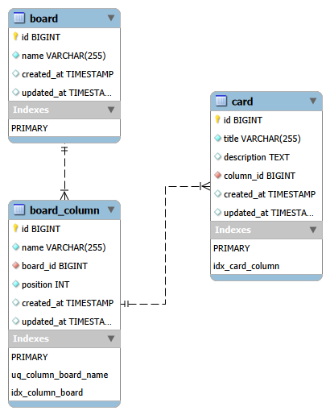

# Mini-Kanban

## Descrição do Projeto
**Mini-Kanban** é uma aplicação web simples para gerenciamento de tarefas no estilo Kanban.  
O projeto é composto por três partes principais: **Back-end**, **Front-end** e **Banco de Dados**.  

- O **Banco de Dados** será **MySQL**, responsável por armazenar as informações de tarefas, colunas e usuários.
- O **Back-end** é desenvolvido em **Java** utilizando **Spring Boot**, fornecendo uma **API RESTful** para manipulação de tarefas.
- O **Front-end** é uma **Single Page Application (SPA)** desenvolvida em **React** com **Vite**, permitindo interação visual com o Kanban.


O objetivo do projeto é permitir que os usuários organizem suas tarefas de forma visual e prática, seguindo o modelo Kanban, com fácil integração entre a interface, a API e o banco de dados.

## Banco de Dados (MySQL)

Este projeto utiliza **MySQL 8** e pode ser facilmente configurado usando Docker no Ubuntu.

### Pré-requisitos

- Docker instalado no sistema.

### Passos para subir o banco de dados

1. Atualize os pacotes do sistema:

    ```bash
    sudo apt update
    ```

2. Instale o Docker (caso ainda não esteja instalado):

    ```bash
    sudo apt install docker.io -y
    ```

3. Crie um diretório para persistência dos dados do MySQL:

    ```bash
    mkdir -p ~/mysql-data
    ```

4. Execute o container do MySQL:

    ```bash
    docker run -d \
    --name mysql8 \
    -e MYSQL_ROOT_PASSWORD=root \
    -e MYSQL_DATABASE=MiniKanban \
    -e MYSQL_USER=appuser \
    -e MYSQL_PASSWORD=p67WD6dR4U3XuzlEa2QfA4cLtAB1F \
    -p 3306:3306 \
    -v ~/mysql-data:/var/lib/mysql \
    mysql:8.0
    ```
    ### Parâmetros importantes:

    - **MYSQL_ROOT_PASSWORD**: senha do usuário root.
    - **MYSQL_DATABASE**: nome do banco que será criado.
    - **MYSQL_USER**: usuário de acesso ao banco.
    - **MYSQL_PASSWORD**: senha de acesso ao banco.
    - **-p 3306:3306**: porta que o MySQL ficará exposto no host (host:container).

### Comandos Úteis

- Para verificar se o container está rodando:

    ```bash
    docker ps
    ```

- Parar o container:

    ```bash
    docker stop mysql8
    ```

- Iniciar o container:

    ```bash
    docker start mysql8
    ```

- Reiniciar o container:

    ```bash
    docker restart mysql8
    ```
### Diagrama ER do Banco

Abaixo está o diagrama ER gerado pelo MySQL Workbench, mostrando as tabelas e relacionamentos do banco de dados:



As três entidades são: **Board**, **Board_Column** e **Card**, com os seguintes atributos e relacionamentos:

### Tabelas e Atributos

- **Board (Quadro)**
  - `id` (PK): Identificador único do quadro
  - `name`: Nome do quadro
  - `created_at / updated_at`: Timestamps de criação e atualização

- **Board_Column (Coluna)**
  - `id` (PK): Identificador único da coluna
  - `name`: Nome da coluna
  - `board_id` (FK → Board.id): Quadro ao qual pertence
  - `position`: Ordem da coluna no quadro
  - `created_at / updated_at`: Timestamps
  - **Restrição:** nome único por quadro (`board_id + name`)

- **Card (Cartão/Tarefa)**
  - `id` (PK): Identificador único do cartão
  - `title`: Título da tarefa
  - `description`: Descrição opcional
  - `column_id` (FK → Board_Column.id): Coluna à qual pertence
  - `created_at / updated_at`: Timestamps

### Relacionamentos

- **Board → Board_Column**: 1:N  
  Um quadro possui várias colunas.  
  `Board_Column.board_id → Board.id` com `ON DELETE CASCADE`

- **Board_Column → Card**: 1:N  
  Uma coluna possui vários cartões.  
  `Card.column_id → Board_Column.id` com `ON DELETE CASCADE`
